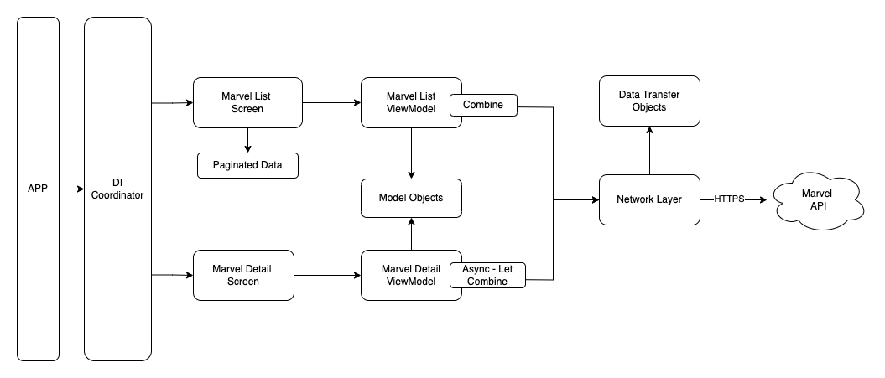

  
 

# Deadpool

Deadpool is a tvOS application built with SwiftUI that fetches Marvel characters from the Marvel API, implements pagination, displays character details, and lists their associated comics. It follows an MVVM-C architecture pattern, utilizes Combine and async-let for asynchronous operations, and employs automated UI and unit tests.

## Features

- Fetches Marvel characters from the Marvel API.
- Implements pagination for character listing.
- Displays detailed information and comics associated with each character.
- Built using SwiftUI for a native tvOS experience.
- **MVVM-C** architecture with **Combine** for reactive programming.
- **Dependency injection** for testability and modularity.
- No third-party libraries used, ensuring lightweight and customizability.

## Architecture Diagram

*Diagram illustrating the MVVM-C architecture with SwiftUI, Combine, and async-let.*

## Screenshots

*Marvel list.*

*Marvel details.*

## Tests

Unit tests and UI tests are included to ensure the stability and functionality of the Deadpool app. **Testable architecture** and **test-driven development** principles are followed to maintain code quality and reliability.

To run tests, navigate to the project directory in Terminal and execute:

(`xcodebuild test -scheme Deadpool -destination 'platform=tvOS Simulator,name=Apple TV'`)

## Installation

Clone the repository and open the project in Xcode 15 or later. Ensure you have an active internet connection to fetch data from the Marvel API.

## Usage

1. Launch the Deadpool app on your tvOS device or simulator.
2. Use the remote control to navigate through Marvel characters.
3. Select a character to view details and associated comics.
4. Enjoy exploring Marvel Universe characters on your tvOS device!

## How to Contribute

1. Fork the repository.
2. Create your feature branch (`git checkout -b feature/AmazingFeature`).
3. Commit your changes (`git commit -am 'Add some AmazingFeature'`).
4. Push to the branch (`git push origin feature/AmazingFeature`).
5. Open a pull request.

